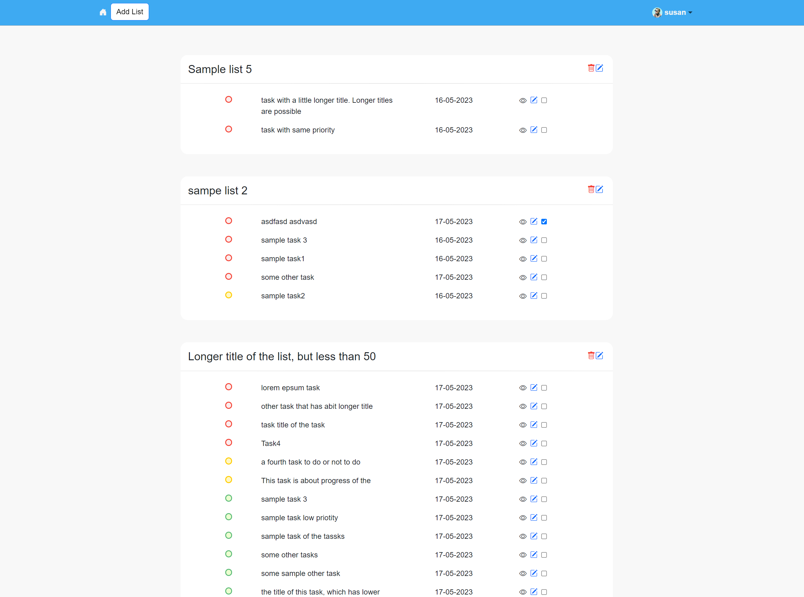
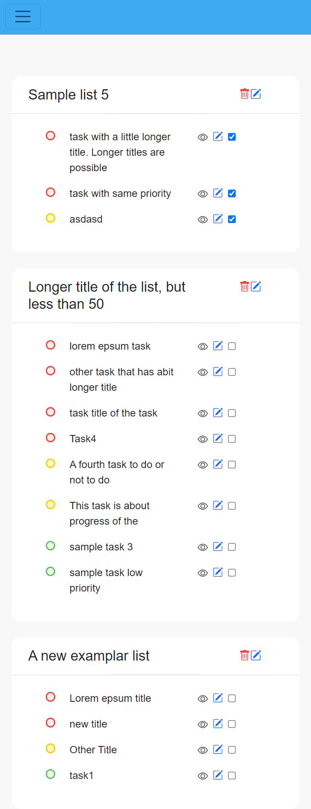
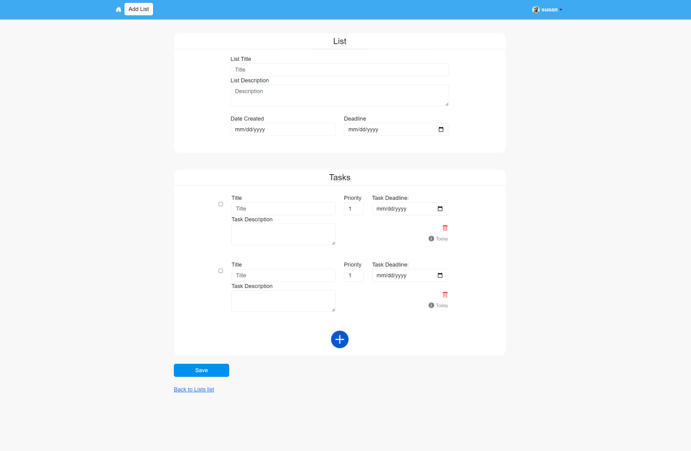
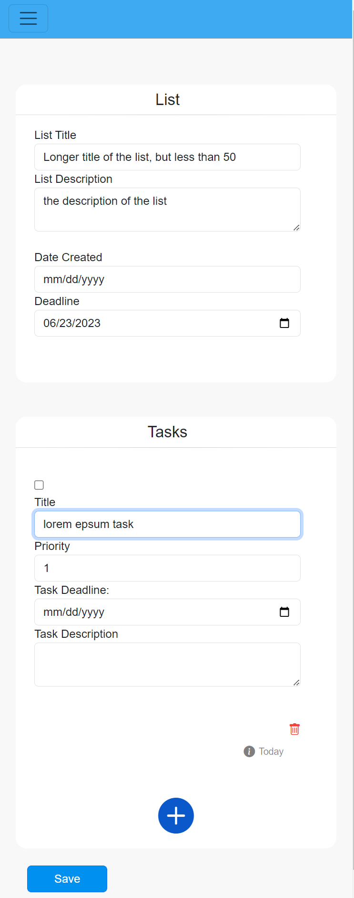
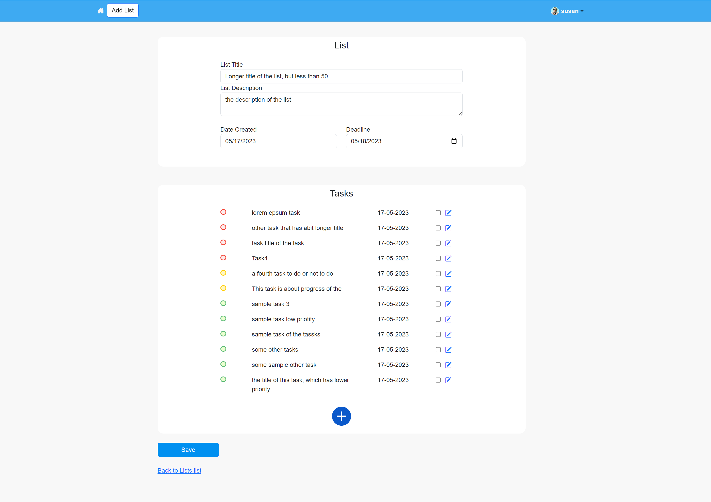
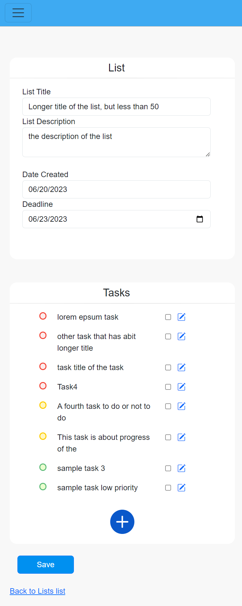
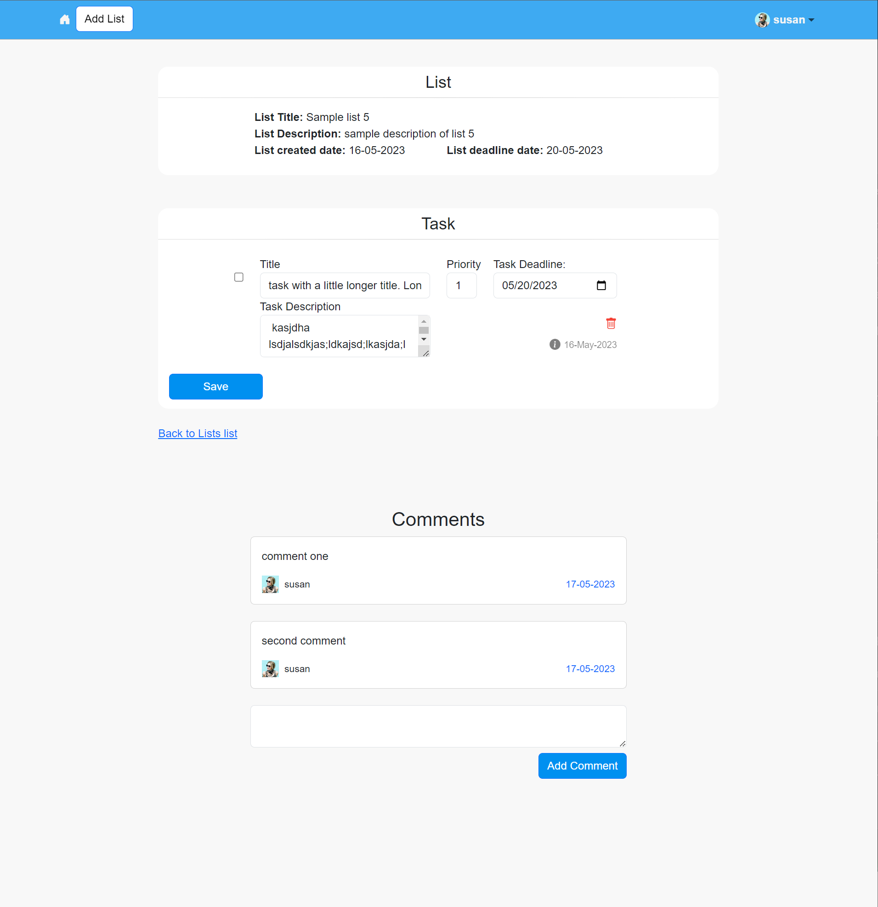
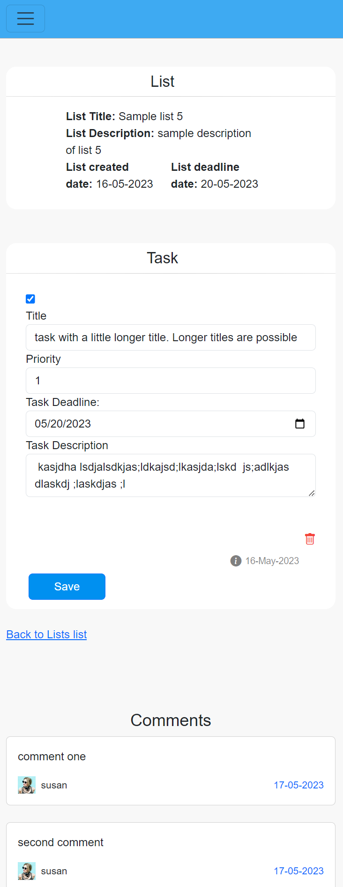
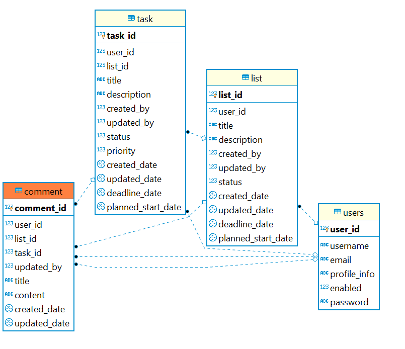

# TodoList Task Manager

No live DEMO of The Task Manager currently

A task manager, Implemented with thymeleaf and spring boot. The main features are:
  * Spring Boot Security with custom database login
  * Spring Boot JPA for data extraction
  * Spring MVC for views, using thymeleaf as a template Manager
  * spring boot validation for form input validation
  * Thymeleaf
  * PostgreSQL


&emsp;**+**&emsp;
&emsp;**+**

## Interfaces
|| Web | Mobile |
|:--|:-----:|-----:|
|List|  |  |
|New List|  |  |
|Update List|   |   |
|Task View|||

## Create Database Tables

Run the database script from sql_scripts/todolist.sql to generate the postgreSQL tables for the application and users and roles.


Default users generated with the script:
```bash
user: susan ; password: demo123
user: john ; password: demo123
```



## Run

using maven and spring boot:

```bash
mvn spring-boot:run
```
or generating manually the jar by building the project with mave3n:

```bash
mvn clean install
```

and then executing the jar from the home project directory

```bash
java -jar .\target\TaskManager-0.0.1-SNAPSHOT.jar
```
